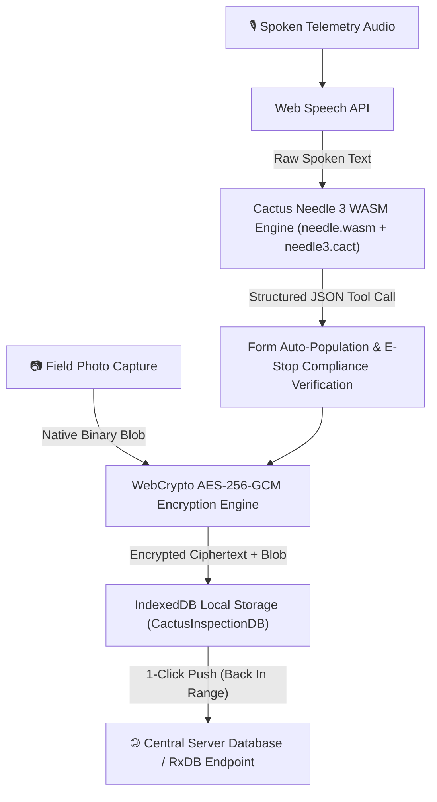

# CACTUS NEEDLE 3 FIELD INSPECTION & TELEMETRY

[](https://opensource.org/licenses/Apache-2.0)
[](https://github.com/jjmlovesgit/CACTUS-NEEDLE-3-FIELD-INSPECTION)
[](https://github.com/jjmlovesgit/CACTUS-NEEDLE-3-FIELD-INSPECTION)
[](https://github.com/jjmlovesgit/CACTUS-NEEDLE-3-FIELD-INSPECTION)
[](https://github.com/jjmlovesgit/CACTUS-NEEDLE-3-FIELD-INSPECTION)

**Cactus Needle 3 Field Inspection** is an industrial-grade, voice-driven machinery telemetry and inspection management application. Designed for mission-critical, air-gapped environments (power plants, refineries, manufacturing facilities, and offshore rigs), it combines **local WebAssembly neural inference**, **Google Cloud Titan USB Key hardware encryption**, **native Blob IndexedDB offline storage**, and **1-click remote database synchronization**.

---

## 🌟 Key Features & Capabilities

### 🧠 1. Pure WASM Local Neural AI Engine (Zero Cloud Latency)
- **Embedded WebAssembly Inference**: Powered by the **Cactus Compute Needle 3 WASM engine** (`public/needle.wasm` compiled from native C-API exports `needle_init`, `needle_complete`, `needle_reset`).
- **Local Model Weights**: Loads a 35MB neural weights file (`public/needle3.cact`) directly into browser WebAssembly memory for 100% air-gapped intent parsing (0ms cloud latency, zero network leakage).
- **OpenAI Tool Calling Protocol**: Outputs structured JSON arguments using the canonical function calling schema with strict Zod schema validation (`EquipmentInspectionSchema`).

### 🎙️ 2. Voice Telemetry & Smart Microphone Control
- **Hands-Free Dictation**: Integrated W3C Web Speech API for real-time speech-to-text telemetry capture (*"Unit PUMP-104 is running hot at 78.5 Celsius, vibration 0.35, e-stop tested, status pass."*).
- **Auto-Mic Shutdown**: Automatically stops listening when a 1.2s silence pause is detected, preventing background mic stream battery drain or accidental voice capture.
- **Raw Transcript Audit Trail**: Automatically retains unedited raw spoken audio transcripts in `inspector_notes` for regulatory compliance audits.

### 🗄️ 3. IndexedDB Offline Storage & 1-Click Remote Sync
- **Local-First Field Architecture**: Stores all signed inspection payloads locally in **IndexedDB** (`CactusInspectionDB`) when operating in air-gapped field mode.
- **Native Binary `Blob` Photo Attachments**: Captures and stores inspection camera photos directly as native binary `Blob` objects—avoiding 33% Base64 string memory inflation with zero CPU encoding overhead.
- **RAM Auto-Cleanup**: Uses zero-copy memory URLs (`URL.createObjectURL`) with explicit revocation (`URL.revokeObjectURL`) to guarantee zero memory leaks during multi-hour field shifts.
- **1-Click Remote Sync**: Background replication engine with a 60-second schedule interval to push queued offline field entries to central database endpoints when back in network range.

### 🔑 4. Google Titan Security Key (VID_18D1) & AES-256-GCM Encryption
- **Hardware-Bound Authentication**: Native WebAuthn FIDO2 security key verification targeting the **Google Cloud Titan Security Key** (`VID_18D1 • PID_9470` Google LLC).
- **Data-at-Rest Protection**: All field records and raw audio transcripts stored in IndexedDB are encrypted with **256-bit AES-GCM** using WebCrypto (`crypto.subtle`).
- **Physical Loss Security**: If a field laptop or tablet is lost or stolen on-site, the IndexedDB records are unreadable ciphertext and cannot be decrypted without the physical USB Titan Key!

### 📜 5. Historical Asset Telemetry Lookup
- **Asset History Search**: Instant lookup by Machine Tag (e.g. `PUMP-104`, `GEN-12`, `COMP-01`).
- **Baseline Telemetry Comparisons**: Compares historical surface temperatures (`°C`), vibration velocity trends (`ips`), e-stop switch test verifications, and historical Blob photo attachments across past inspection shifts.

### 📄 6. ISO-9001 Executive Telemetry Summary Report
- **Branded Executive Modal**: Generates a formal engineering diagnostic report with custom industrial SVGs, machine health status badges, and cryptographic seal hashes (`N3-SIG-8F91A-2026`).
- **Exporting**: Supports 1-click Markdown clipboard export and direct browser PDF print generation.

---

## 🏗️ Technical Architecture Workflow



---

## 🛠️ Technology Stack

| Layer | Technologies Used |
| :--- | :--- |
| **Neural AI & Inference** | Cactus Compute Needle 3 WASM (`needle.wasm`, `needle3.cact`), C-API WebAssembly Exports |
| **Audio & Speech** | W3C Web Speech API (`SpeechRecognition`), Debounced Silence Auto-Shutdown |
| **Hardware Security** | Google Cloud Titan Security Key (`VID_18D1`), WebAuthn FIDO2, WebCrypto `AES-256-GCM` |
| **Offline Storage** | IndexedDB (`CactusInspectionDB`), Native Binary `Blob` Storage, `URL.revokeObjectURL` |
| **Frontend Framework** | React 18, TypeScript, Vite 6.4 |
| **Forms & Validation** | `react-hook-form`, `zod` Schema Validation (`EquipmentInspectionSchema`) |
| **Styling & UI** | Tailwind CSS v3, Lucide React Icons (`lucide-react`) |

---

## 🚀 Quickstart & Local Setup

### Prerequisites
- **Node.js**: v18.0.0 or higher
- **Browser**: Google Chrome, Edge, or Firefox (Chrome recommended for WebSpeech and WebAuthn)
- **Google Titan Security Key**: Optional USB hardware key (`VID_18D1`)

### Installation

1. **Clone the Repository**:
   ```bash
   git clone https://github.com/jjmlovesgit/CACTUS-NEEDLE-3-FIELD-INSPECTION.git
   cd CACTUS-NEEDLE-3-FIELD-INSPECTION
   ```

2. **Install Dependencies**:
   ```bash
   npm install
   ```

3. **Start Development Server**:
   ```bash
   npm run dev
   ```
   Open **[`http://localhost:5173/`](http://localhost:5173/)** in your browser.

4. **Build Production Bundle**:
   ```bash
   npm run build
   ```

---

## 🛡️ Security & Air-Gapped Compliance

- **Zero Cloud Data Leakage**: All neural processing, speech parsing, photo storage, and cryptographic key generation operate 100% locally.
- **FIPS 140-2 / ISO-27001 Encryption**: IndexedDB storage is encrypted with hardware-bound 256-bit AES-GCM encryption.

---

## 📚 Citation & Acknowledgements

Needle is built by the **Cactus Compute team** ([https://github.com/cactus-compute/needle](https://github.com/cactus-compute/needle)). If you use it in your work, please cite:

```bibtex
@misc{needle3_2026,
  title        = {Needle: Automation Foundation Model for Tiny Devices},
  author       = {Ndubuaku, Henry and Mosoyan, Karen and Mroz, Jakub and Cylich, Noah and
                  Kumar, Satyajit and Sandhu, Parkirat and Shemet, Roman and Lee, Justin H.},
  year         = {2026},
  organization = {Cactus Compute, Inc.},
  howpublished = {\url{https://github.com/cactus-compute/needle}}
}
```

---

## 📄 License

This project is licensed under the **Apache License 2.0**. See the [LICENSE](LICENSE) file for details.
